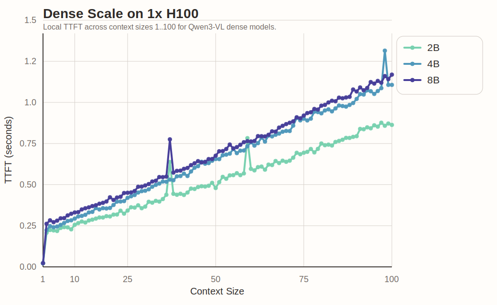
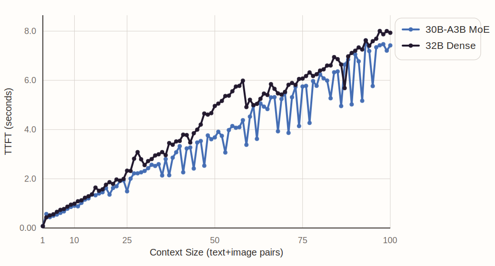
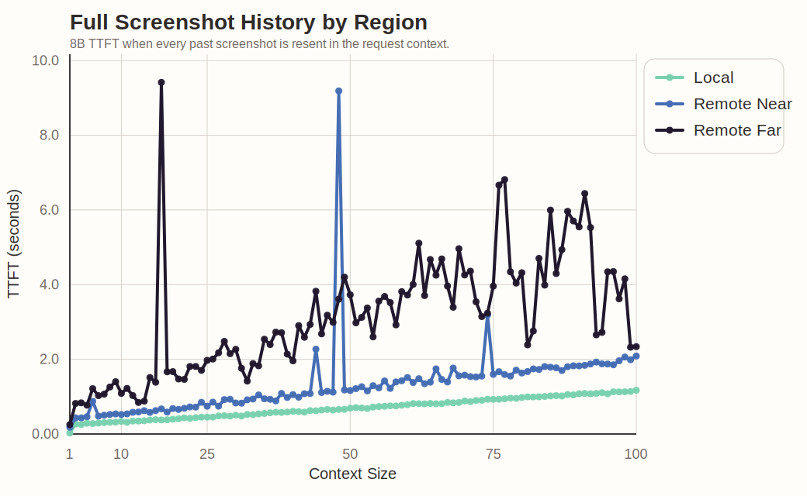
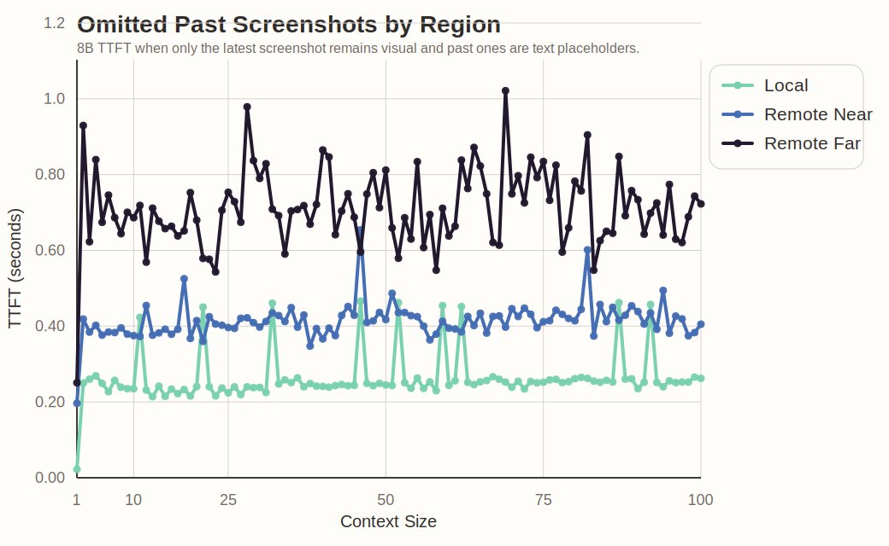

# Inference Latency Study

Controlled benchmark for measuring inference latency in screenshot-based computer-use VLM agents.

This repo answers one question:

**What are the main latency bottlenecks in computer-use multimodal inference, and how do model size, payload growth, and deployment distance change that latency?**

Specifically, this repo asks:

1. How does inference latency scale with model size within the same dense `Qwen3-VL` family?
   Compare `2B`, `4B`, `8B`, and `32B` dense models under the same hardware, payload, and server settings.
2. How does a MoE model compare to a dense model at roughly the same scale?
   Compare `Qwen3-VL-30B-A3B` against `Qwen3-VL-32B` under the same conditions.
3. How does latency grow as context size grows?
   Measure latency as the number of text+image pairs in a single `user` message increases from `1` to `100`.
4. How much of that growth comes from resending past images versus preserving only textual state?
   Compare full-history requests against requests where prior images are replaced with a text placeholder such as `"image omitted"`.
5. How much does network distance matter when only the current image is sent?
   Compare a nearby remote server against a farther remote server when prior images are omitted and only one image is included per request.
6. How much does network distance matter when multimodal history is fully resent each turn?
   Compare a nearby remote server against a farther remote server as image history grows from `1` to `100` images.
7. How do hosted providers compare in practice?
   Run the same product-facing payloads against selected providers on OpenRouter as a practical appendix, separate from the controlled `Qwen3-VL` study.

This repo studies application-layer decisions for screenshot-based VLM agents: how latency changes as context grows, how much of that cost comes from resending images, how deployment distance affects the result, and how those tradeoffs move across model choices and providers.

## What It Measures

- Time to first token (`TTFT`)
- Total completion latency

`decode_tps` may still be logged as a secondary diagnostic, but the primary metrics in this study are `TTFT` and total latency.

## Repo Layout

```text
Makefile                  Server-side: start/stop vLLM
requirements.txt          Python dependencies
data/
  screenshots/            Fixed screenshot corpus used by the study
study/
  capture.py              Optional screenshot capture utility
  run.py                  Run one benchmark case from a YAML config
  aggregate.py            Re-aggregate a JSONL file into CSV
  plot.py                 Generate SVG plots for the README from summary CSVs
  configs/                Experiment configs
```

## Setup

Install the Python dependencies:

```bash
pip install -r requirements.txt
```

On the GPU node, start vLLM:

```bash
make vllm-up
```

This bootstraps a repo-local `.venv/` if needed and uses that environment's `vllm` binary.

To watch startup logs:

```bash
make vllm-logs
```

To use a different backend model:

```bash
make vllm-up MODEL=Qwen/Qwen3-VL-4B-Instruct
```

The client config should use the same real model name that the server is serving.

## Running One Case

Each YAML file in `study/configs/` describes one benchmark case. `study/run.py` reads the config, runs the requests, writes raw JSONL, and writes a CSV summary automatically at the end.

One context unit means:

- one text content block
- one screenshot content block
- both placed inside the same single OpenAI `user` message

So `context_max_size: 4` means the study will warm the server first, then measure context sizes `1`, `2`, `3`, and `4` on one live server, where each measured request is one `user` message containing that many text+image pairs unless the context mode omits past screenshots.

The repo currently includes:

- `4` dense-scale sweeps
- `2` dense-vs-MoE sweeps
- `5` context-growth sweeps
- provider appendix sweeps under `study/configs/providers/`

Example local run:

```bash
python study/run.py --config study/configs/dense_scale/qwen3_vl_8b_local.yaml
```

Example remote run with a config override:

```bash
python study/run.py \
  --config study/configs/history_sweeps/full_remote_near.yaml \
  --base-url https://<POD_ID>-8000.proxy.runpod.net/v1
```

Example remote run with both model and base URL override:

```bash
python study/run.py \
  --config study/configs/history_sweeps/omit_past_remote_far.yaml \
  --base-url https://<POD_ID>-8000.proxy.runpod.net/v1 \
  --model Qwen/Qwen3-VL-8B-Instruct
```

Useful config fields:

- `experiment`
- `model`
- `base_url`
- `region`
- `context_mode`
- `context_max_size`
- `warmup_size`
- `max_tokens`
- `output_path`

Current context modes:

- `full_history`: every context unit keeps both its text block and its screenshot block
- `omit_past_history`: only the latest context unit keeps its screenshot block; earlier screenshot blocks are replaced with the text placeholder `"[image omitted]"`

## Methodology

Every experiment in this repo does the same thing:

1. start a live server
2. warm it up with `warmup_size` requests
3. measure a context sweep from size `1` through `context_max_size`
4. write raw JSONL and a CSV summary

The sweep is the experiment. We compare that same sweep across:

- dense model scales
- dense versus MoE
- local versus remote-near versus remote-far
- full-history versus omitted-history context modes
- different providers

Within a sweep, do **not** restart the server between increments. The study intentionally assumes prefix-cache reuse during context growth, because that matches real-world screenshot-agent usage.

Between independent sweeps, restart the server manually:

```bash
make vllm-down
make vllm-up
```

## Runs Completed Today

The current benchmark outputs in `results/` were generated with the workflow below.

1. Create a RunPod node.
2. SSH into the node and start `vllm serve` manually in the foreground.
3. For local runs, execute `study/run.py` on the GPU node and point it at `http://localhost:8000/v1`.
4. For remote runs, execute `study/run.py` from this machine and point it at `https://<POD_ID>-8000.proxy.runpod.net/v1`.
5. Restart `vllm` manually between independent sweeps so caches do not leak across experiments.
6. Within a sweep, keep one live server and measure context sizes `1..100` so prefix-cache reuse remains part of the workload.

The nodes used today were:

- `1x H100 SXM`, `US-CA-2`
  used for dense scale `2B/4B/8B`, local full-history and omitted-history, and remote-near full-history and omitted-history
- `2x H100 SXM`, tensor parallel `2`
  used for the local `32B dense` versus `30B-A3B MoE` comparison
- `1x H100 SXM`, `US-MO-1`
  used for remote-far full-history and omitted-history

The exact server launch commands used were:

`1x H100`, `2B`
```bash
.venv/bin/vllm serve Qwen/Qwen3-VL-2B-Instruct \
  --host 0.0.0.0 \
  --port 8000 \
  --served-model-name Qwen/Qwen3-VL-2B-Instruct \
  --enable-prefix-caching \
  --tensor-parallel-size 1 \
  --trust-remote-code
```

`1x H100`, `4B`
```bash
.venv/bin/vllm serve Qwen/Qwen3-VL-4B-Instruct \
  --host 0.0.0.0 \
  --port 8000 \
  --served-model-name Qwen/Qwen3-VL-4B-Instruct \
  --enable-prefix-caching \
  --tensor-parallel-size 1 \
  --trust-remote-code
```

`1x H100`, `8B`
```bash
.venv/bin/vllm serve Qwen/Qwen3-VL-8B-Instruct \
  --host 0.0.0.0 \
  --port 8000 \
  --served-model-name Qwen/Qwen3-VL-8B-Instruct \
  --enable-prefix-caching \
  --tensor-parallel-size 1 \
  --trust-remote-code
```

`2x H100`, `32B dense`
```bash
.venv/bin/vllm serve Qwen/Qwen3-VL-32B-Instruct \
  --host 0.0.0.0 \
  --port 8000 \
  --served-model-name Qwen/Qwen3-VL-32B-Instruct \
  --enable-prefix-caching \
  --tensor-parallel-size 2 \
  --trust-remote-code
```

`2x H100`, `30B-A3B MoE`
```bash
.venv/bin/vllm serve Qwen/Qwen3-VL-30B-A3B-Instruct \
  --host 0.0.0.0 \
  --port 8000 \
  --served-model-name Qwen/Qwen3-VL-30B-A3B-Instruct \
  --enable-prefix-caching \
  --tensor-parallel-size 2 \
  --trust-remote-code
```

The completed runs are:

- dense scale, local: `Qwen3-VL-2B`
- dense scale, local: `Qwen3-VL-4B`
- dense scale, local: `Qwen3-VL-8B`
- dense vs MoE, local on `2xH100`: `Qwen3-VL-32B` and `Qwen3-VL-30B-A3B`
- full-history, local: `Qwen3-VL-8B`
- omit-past-history, local: `Qwen3-VL-8B`
- full-history, remote-near (`US-CA-2`): `Qwen3-VL-8B`
- omit-past-history, remote-near (`US-CA-2`): `Qwen3-VL-8B`
- full-history, remote-far (`US-MO-1`): `Qwen3-VL-8B`
- omit-past-history, remote-far (`US-MO-1`): `Qwen3-VL-8B`

The generated raw JSONL files are:

- [dense_scale_qwen3_vl_2b_local.jsonl](/Users/eddyliang/Desktop/workfile/inference-latency-study/results/raw/dense_scale_qwen3_vl_2b_local.jsonl)
- [dense_scale_qwen3_vl_4b_local.jsonl](/Users/eddyliang/Desktop/workfile/inference-latency-study/results/raw/dense_scale_qwen3_vl_4b_local.jsonl)
- [dense_scale_qwen3_vl_8b_local.jsonl](/Users/eddyliang/Desktop/workfile/inference-latency-study/results/raw/dense_scale_qwen3_vl_8b_local.jsonl)
- [dense_vs_moe_qwen3_vl_32b_dense_local.jsonl](/Users/eddyliang/Desktop/workfile/inference-latency-study/results/raw/dense_vs_moe_qwen3_vl_32b_dense_local.jsonl)
- [dense_vs_moe_qwen3_vl_30b_a3b_moe_local.jsonl](/Users/eddyliang/Desktop/workfile/inference-latency-study/results/raw/dense_vs_moe_qwen3_vl_30b_a3b_moe_local.jsonl)
- [history_sweep_full_local.jsonl](/Users/eddyliang/Desktop/workfile/inference-latency-study/results/raw/history_sweep_full_local.jsonl)
- [history_sweep_omit_past_local.jsonl](/Users/eddyliang/Desktop/workfile/inference-latency-study/results/raw/history_sweep_omit_past_local.jsonl)
- [history_sweep_full_remote_near.jsonl](/Users/eddyliang/Desktop/workfile/inference-latency-study/results/raw/history_sweep_full_remote_near.jsonl)
- [history_sweep_omit_past_remote_near.jsonl](/Users/eddyliang/Desktop/workfile/inference-latency-study/results/raw/history_sweep_omit_past_remote_near.jsonl)
- [history_sweep_full_remote_far.jsonl](/Users/eddyliang/Desktop/workfile/inference-latency-study/results/raw/history_sweep_full_remote_far.jsonl)
- [history_sweep_omit_past_remote_far.jsonl](/Users/eddyliang/Desktop/workfile/inference-latency-study/results/raw/history_sweep_omit_past_remote_far.jsonl)

The generated summary CSV files are:

- [dense_scale_qwen3_vl_2b_local.csv](/Users/eddyliang/Desktop/workfile/inference-latency-study/results/summaries/dense_scale_qwen3_vl_2b_local.csv)
- [dense_scale_qwen3_vl_4b_local.csv](/Users/eddyliang/Desktop/workfile/inference-latency-study/results/summaries/dense_scale_qwen3_vl_4b_local.csv)
- [dense_scale_qwen3_vl_8b_local.csv](/Users/eddyliang/Desktop/workfile/inference-latency-study/results/summaries/dense_scale_qwen3_vl_8b_local.csv)
- [dense_vs_moe_qwen3_vl_32b_dense_local.csv](/Users/eddyliang/Desktop/workfile/inference-latency-study/results/summaries/dense_vs_moe_qwen3_vl_32b_dense_local.csv)
- [dense_vs_moe_qwen3_vl_30b_a3b_moe_local.csv](/Users/eddyliang/Desktop/workfile/inference-latency-study/results/summaries/dense_vs_moe_qwen3_vl_30b_a3b_moe_local.csv)
- [history_sweep_full_local.csv](/Users/eddyliang/Desktop/workfile/inference-latency-study/results/summaries/history_sweep_full_local.csv)
- [history_sweep_omit_past_local.csv](/Users/eddyliang/Desktop/workfile/inference-latency-study/results/summaries/history_sweep_omit_past_local.csv)
- [history_sweep_full_remote_near.csv](/Users/eddyliang/Desktop/workfile/inference-latency-study/results/summaries/history_sweep_full_remote_near.csv)
- [history_sweep_omit_past_remote_near.csv](/Users/eddyliang/Desktop/workfile/inference-latency-study/results/summaries/history_sweep_omit_past_remote_near.csv)
- [history_sweep_full_remote_far.csv](/Users/eddyliang/Desktop/workfile/inference-latency-study/results/summaries/history_sweep_full_remote_far.csv)
- [history_sweep_omit_past_remote_far.csv](/Users/eddyliang/Desktop/workfile/inference-latency-study/results/summaries/history_sweep_omit_past_remote_far.csv)

One deliberate methodological note:

- `32B dense` was not included in the `1xH100` dense-scale series, because it does not fit on a single H100 without changing the serving setup. Instead, `32B dense` was run in the separate `2xH100` dense-vs-MoE comparison against `30B-A3B`.

## Findings

These runs answer most of the README's core questions:

- dense scale on the same `1xH100` hardware is covered for `2B`, `4B`, and `8B`
- dense versus MoE is covered for `32B dense` versus `30B-A3B` on the same `2xH100` setup
- context growth is covered from `1` to `100` text+image pairs
- full-history versus omitted-history is covered locally, from a near remote region, and from a farther remote region

These runs do not yet cover:

- `32B` in the same apples-to-apples `1xH100` dense-scale plot
- the OpenRouter provider appendix

One important caveat:

- each context size currently has a single measured request, so these curves should be read as observed sweep traces rather than robust percentile benchmarks

### Dense Scale on 1x H100



- on the same `1xH100`, `2B`, `4B`, and `8B` all stay in the sub-`1.5s` TTFT regime even at context size `100`
- at context size `100`, local TTFT is about `0.863s` for `2B`, `1.107s` for `4B`, and `1.169s` for `8B`
- model scale matters, but within `2B -> 8B` it is not the dominant source of latency compared with multimodal context growth

### 30B-A3B MoE vs 32B Dense on 2x H100



- `30B-A3B` is consistently faster than `32B dense` under the same `2xH100` tensor-parallel setup
- at context size `100`, TTFT is about `7.419s` for `30B-A3B` versus `7.933s` for `32B dense`
- both large models are far slower than `8B`, so the study ends up showing two regimes: `2B/4B/8B` and `30B/32B`

### Full Screenshot History by Region



- resending full screenshot history is the steepest latency driver in the study
- at context size `100`, TTFT is about `1.170s` local, `2.089s` remote-near, and `2.340s` remote-far
- remote full-history runs also showed real instability spikes, including about `9.189s` at context size `48` in the near run and about `9.418s` at context size `17` in the far run

### Omitted Past Screenshots by Region



- replacing old screenshots with text placeholders flattens the curve dramatically
- at context size `100`, TTFT is about `0.262s` local, `0.405s` remote-near, and `0.723s` remote-far
- compared with full-history at context size `100`, omitted-history reduces TTFT to about:
  - `22%` of full-history locally
  - `19%` of full-history remote-near
  - `31%` of full-history remote-far

### Plot Generation

Regenerate the README plots from the summary CSVs with:

```bash
python study/plot.py
```

## Optional: Capture More Screenshots

The repo already includes a fixed screenshot corpus under `data/screenshots/`, so capture is not required for normal use.

If you want to collect more screenshots:

```bash
python study/capture.py
```

Left-click saves a screenshot. Right-click stops.

## Optional: Re-Aggregate A Run

`study/run.py` already writes a summary CSV automatically. `study/aggregate.py` only exists if you want to re-aggregate an old JSONL file.

```bash
python study/aggregate.py \
  --input results/raw/history_sweep_full_remote_near.jsonl
```

## RunPod

Create a pod:

```bash
runpodctl create pod \
  --gpuType "NVIDIA H100 80GB HBM3" \
  --name "inference-latency-study" \
  --dataCenterId "US-CA-2" \
  --imageName "runpod/pytorch:2.4.0-py3.11-cuda12.4.1-devel-ubuntu22.04" \
  --containerDiskSize 50 \
  --volumeSize 50 \
  --ports "8000/http" \
  --startSSH
```

The vLLM API will be exposed at:

```text
https://<POD_ID>-8000.proxy.runpod.net/v1
```

Useful commands:

```bash
runpodctl get pod
runpodctl ssh connect <POD_ID>
runpodctl stop pod <POD_ID>
runpodctl remove pod <POD_ID>
```

## What Still Needs To Change

The main controlled `Qwen3-VL` study has now been run. The remaining work is:

- run the OpenRouter provider appendix sweeps
- rerun selected cases with repeated measurements if stronger percentile claims are needed
