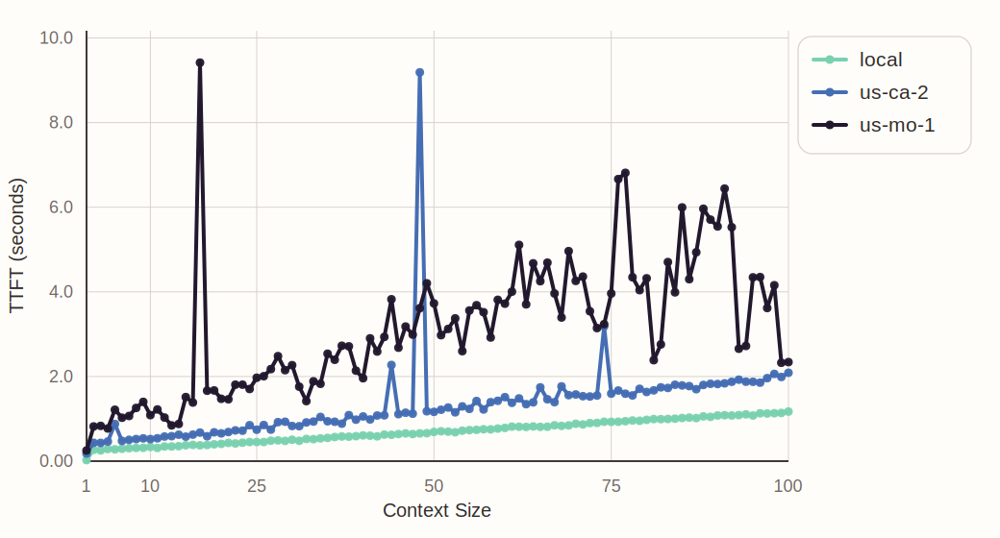
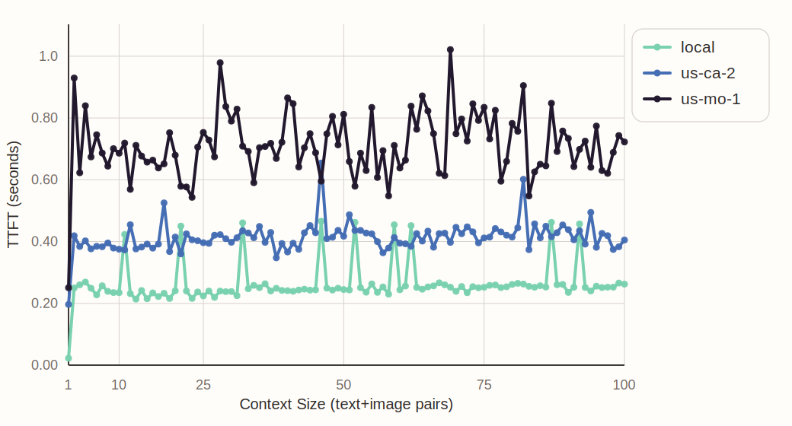

# Inference Latency Study

Benchmark for screenshot-based computer-use agents that asks a simple question: which levers most meaningfully reduce inference latency?

This repo compares three practical levers:
- model size
- how much screenshot history is included in each request
- where the model server is located

This repo measures latency only, not response quality. The model response is discarded.

## Quick Start

On the GPU node:

```bash
pip install uv
uv venv
source .venv/bin/activate
uv pip install -r requirements.txt
```

Start the vLLM server. Example:

```bash
.venv/bin/vllm serve Qwen/Qwen3-VL-8B-Instruct \
  --host 0.0.0.0 \
  --port 8000 \
  --served-model-name Qwen/Qwen3-VL-8B-Instruct \
  --enable-prefix-caching \
  --tensor-parallel-size 1 \
  --trust-remote-code
```

Then run a case:

```bash
python study/run.py --config study/configs/dense_scale/qwen3_vl_8b_local.yaml
```

Or run from another machine against the RunPod proxy URL:

```bash
python study/run.py \
  --config study/configs/screenshot_history/full_us_ca_2.yaml \
  --base-url https://<POD_ID>-8000.proxy.runpod.net/v1
```

## Findings

Resending every past screenshot makes latency grow quickly. Replacing older screenshots with text placeholders keeps the curve much flatter.

Model size and server distance also matter, but less than screenshot history.

### Model Comparison on 1x H100


Client and server ran on the same GPU node over `localhost` on `1x H100`.

### Model Comparison on 2x H100


Client and server ran on the same GPU node with `2x H100` in tensor parallel.

### Requesting Over Internet



This uses the 8B model and resends the full screenshot history over the internet from Mountain View to servers in California and Missouri.

### Omit Past Screenshot History



This uses the same setup, but keeps only the latest text+image pair and replaces older screenshots with placeholder text.

## Misc

Data and outputs:

- input screenshots: [data/screenshots](/Users/eddyliang/Desktop/workfile/inference-latency-study/data/screenshots)
- raw outputs: [results/raw](/Users/eddyliang/Desktop/workfile/inference-latency-study/results/raw)
- summary CSVs: [results/summaries](/Users/eddyliang/Desktop/workfile/inference-latency-study/results/summaries)
- generated plot assets: [assets/plots](/Users/eddyliang/Desktop/workfile/inference-latency-study/assets/plots)

Main screenshot-history outputs:

- [screenshot_history_full_local.csv](/Users/eddyliang/Desktop/workfile/inference-latency-study/results/summaries/screenshot_history_full_local.csv)
- [screenshot_history_omit_past_local.csv](/Users/eddyliang/Desktop/workfile/inference-latency-study/results/summaries/screenshot_history_omit_past_local.csv)
- [screenshot_history_full_us_ca_2.csv](/Users/eddyliang/Desktop/workfile/inference-latency-study/results/summaries/screenshot_history_full_us_ca_2.csv)
- [screenshot_history_omit_past_us_ca_2.csv](/Users/eddyliang/Desktop/workfile/inference-latency-study/results/summaries/screenshot_history_omit_past_us_ca_2.csv)
- [screenshot_history_full_us_mo_1.csv](/Users/eddyliang/Desktop/workfile/inference-latency-study/results/summaries/screenshot_history_full_us_mo_1.csv)
- [screenshot_history_omit_past_us_mo_1.csv](/Users/eddyliang/Desktop/workfile/inference-latency-study/results/summaries/screenshot_history_omit_past_us_mo_1.csv)

Exact server commands used:

`1x H100`, `Qwen/Qwen3-VL-2B-Instruct`

```bash
.venv/bin/vllm serve Qwen/Qwen3-VL-2B-Instruct \
  --host 0.0.0.0 \
  --port 8000 \
  --served-model-name Qwen/Qwen3-VL-2B-Instruct \
  --enable-prefix-caching \
  --tensor-parallel-size 1 \
  --trust-remote-code
```

`1x H100`, `Qwen/Qwen3-VL-4B-Instruct`

```bash
.venv/bin/vllm serve Qwen/Qwen3-VL-4B-Instruct \
  --host 0.0.0.0 \
  --port 8000 \
  --served-model-name Qwen/Qwen3-VL-4B-Instruct \
  --enable-prefix-caching \
  --tensor-parallel-size 1 \
  --trust-remote-code
```

`1x H100`, `Qwen/Qwen3-VL-8B-Instruct`

```bash
.venv/bin/vllm serve Qwen/Qwen3-VL-8B-Instruct \
  --host 0.0.0.0 \
  --port 8000 \
  --served-model-name Qwen/Qwen3-VL-8B-Instruct \
  --enable-prefix-caching \
  --tensor-parallel-size 1 \
  --trust-remote-code
```

`2x H100`, `Qwen/Qwen3-VL-32B-Instruct`

```bash
.venv/bin/vllm serve Qwen/Qwen3-VL-32B-Instruct \
  --host 0.0.0.0 \
  --port 8000 \
  --served-model-name Qwen/Qwen3-VL-32B-Instruct \
  --enable-prefix-caching \
  --tensor-parallel-size 2 \
  --trust-remote-code
```

`2x H100`, `Qwen/Qwen3-VL-30B-A3B-Instruct`

```bash
.venv/bin/vllm serve Qwen/Qwen3-VL-30B-A3B-Instruct \
  --host 0.0.0.0 \
  --port 8000 \
  --served-model-name Qwen/Qwen3-VL-30B-A3B-Instruct \
  --enable-prefix-caching \
  --tensor-parallel-size 2 \
  --trust-remote-code
```

Regenerate the README plots from the summary CSVs with:

```bash
python study/plot.py
```

RunPod example:

```bash
runpodctl create pod \
  --gpuType "NVIDIA H100 80GB HBM3" \
  --name "inference-latency-study" \
  --dataCenterId "US-CA-2" \
  --imageName "runpod/pytorch:2.4.0-py3.11-cuda12.4.1-devel-ubuntu22.04" \
  --containerDiskSize 50 \
  --volumeSize 50 \
  --ports "8000/http" \
  --startSSH
```

The vLLM API will be exposed at:

```text
https://<POD_ID>-8000.proxy.runpod.net/v1
```

Useful commands:

```bash
runpodctl get pod
runpodctl ssh connect <POD_ID>
runpodctl stop pod <POD_ID>
runpodctl remove pod <POD_ID>
```
